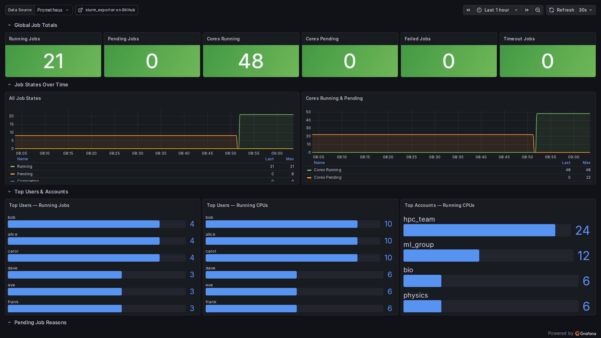
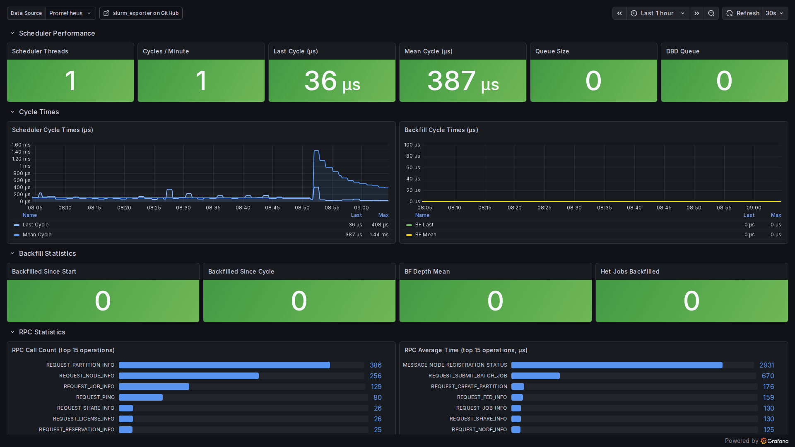
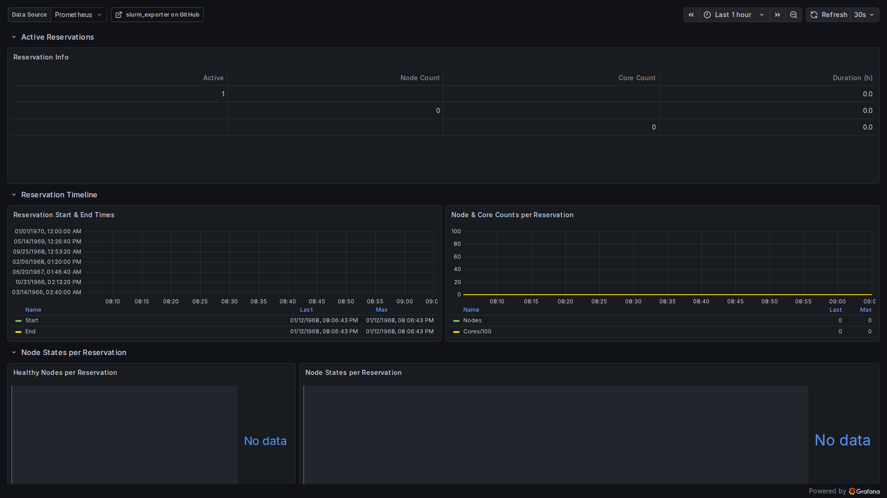

# Prometheus Slurm Exporter 🚀

[](https://github.com/sckyzo/slurm_exporter/actions/workflows/release.yml)
[](https://github.com/sckyzo/slurm_exporter/releases/latest)
[](https://goreportcard.com/report/github.com/sckyzo/slurm_exporter)
[](https://hub.docker.com/r/sckyzo/slurm-exporter)
[](https://hub.docker.com/r/sckyzo/slurm-exporter/tags)
[](https://hub.docker.com/r/sckyzo/slurm-exporter/tags)
[](https://www.gnu.org/licenses/gpl-3.0)

> 📸 **[View Dashboard Screenshots](#-screenshots)**

Prometheus collector and exporter for metrics extracted from the [Slurm](https://slurm.schedmd.com/overview.html) workload manager — exposes node, partition, job, CPU, GPU, scheduler, fairshare, reservation, and license data, with ten ready-to-use Grafana dashboards and a starter set of site-neutral alerting rules.

> [!NOTE]
> Looking for a next-generation Slurm exporter with native OpenMetrics support (Slurm 25.11+)?
> Check out my new project: **[sckyzo/slurm_prometheus_exporter](https://github.com/sckyzo/slurm_prometheus_exporter/)**
>
> ✨ Features: Native OpenMetrics · Multiple endpoints · Basic Auth & TLS · Global labels · YAML config · Clean Architecture

## 📋 Table of Contents

- [✨ Features](#-features)
- [🚀 Quick start](#-quick-start)
- [📦 Installation](#-installation)
- [⚙️ Configuration & development](#%EF%B8%8F-configuration--development)
- [📊 Dashboards & alerts](#-dashboards--alerts)
- [📸 Screenshots](#-screenshots)
- [🔐 Security & supply chain](#-security--supply-chain)
- [🤖 Automation](#-automation)
- [🤝 Contributing](#-contributing)
- [📜 License](#-license)

## ✨ Features

- ✅ Wide metric coverage: nodes, partitions, jobs, CPUs, GPUs, scheduler internals (`sdiag` RPC stats), fairshare, reservations, licenses, per-user/per-account roll-ups.
- ✅ All 14 collectors are optional and toggle via `--collector.<name>` / `--no-collector.<name>` flags.
- ✅ GPU metrics per account and user (`slurm_account_gpus_running`, `slurm_user_gpus_running`) — covers `--gres`, `--gpus`, and `--gpus-per-node` jobs.
- ✅ Per-reservation node state metrics (`slurm_reservation_nodes_*`).
- ✅ TLS + Basic Authentication via `--web.config.file`.
- ✅ OpenMetrics format (exemplars, Prometheus 2.x+ features).
- ✅ Per-collector health metrics (`slurm_exporter_collector_success`, `slurm_exporter_collector_duration_seconds`).
- ✅ Liveness probe at `/healthz` for Kubernetes / systemd orchestration.
- ✅ Ten ready-to-use Grafana dashboards + site-neutral Prometheus alerting rules.
- ✅ Multi-arch Docker images (linux/amd64 + linux/arm64), signed with cosign keyless, CycloneDX SBOM per release.
- ✅ Goreportcard A+ (100% across gofmt, go vet, gocyclo, ineffassign, misspell, license).

---

## 🚀 Quick start

Pick the path that fits your context.

### 🐳 Docker (recommended)

```bash
docker run -d --name slurm_exporter \
  -p 9341:9341 \
  -v /etc/slurm:/etc/slurm:ro \
  -v /var/run/munge:/var/run/munge:ro \
  -v /etc/munge/munge.key:/etc/munge/munge.key:ro \
  sckyzo/slurm-exporter:latest

curl -s http://localhost:9341/metrics | head
```

### 📥 Pre-compiled binary

```bash
# Linux amd64 — replace with your OS/arch
curl -sLo slurm_exporter.tar.gz \
  https://github.com/sckyzo/slurm_exporter/releases/latest/download/slurm_exporter-$(curl -s https://api.github.com/repos/sckyzo/slurm_exporter/releases/latest | jq -r .tag_name | sed 's/^v//')-linux-amd64.tar.gz
tar -xzf slurm_exporter.tar.gz
sudo install slurm_exporter /usr/local/bin/
```

### 🔨 From source

```bash
git clone https://github.com/sckyzo/slurm_exporter.git
cd slurm_exporter
make build
sudo install bin/slurm_exporter /usr/local/bin/
```

Once installed via any path, expose `:9341/metrics` and point Prometheus at it (scrape config in [`monitoring/`](monitoring/)).

---

## 📦 Installation

### 🐳 Docker images

Two image variants are published to both **Docker Hub** (`sckyzo/slurm-exporter`) and **GHCR** (`ghcr.io/sckyzo/slurm_exporter`) as multi-arch manifests (linux/amd64 + linux/arm64).

| Variant | Tag pattern | Base | When |
|---|---|---|---|
| **Standard** | `:vX.Y.Z`, `:X.Y`, `:X`, `:latest` | Ubuntu 26.04 + slurm-client 25.11 | Cluster runs Slurm 23.x — 26.x packaged from a distro. Just works. |
| **Minimal** | `:vX.Y.Z-minimal`, `:X.Y-minimal`, `:X-minimal`, `:latest-minimal` | distroless/cc-debian12 + libmunge | Slurm built from source / OHPC / outside the 23-26 window. Mount your own slurm-client via `--slurm.bin-path`. |

A complete reference (deployment scenarios, env-var overrides, version compatibility, troubleshooting) lives in **[`docker/README.md`](docker/README.md)**. Quick examples for compose and Kubernetes are included there.

Pre-release tags (`vX.Y.Z-rc1` etc.) push only the pinned version and never overwrite floating aliases.

### 📥 Pre-compiled binaries

Linux, macOS, and Windows binaries (amd64 / 386 / arm64) on the [Releases](https://github.com/sckyzo/slurm_exporter/releases) page. Each archive ships with a CycloneDX SBOM and a cosign-verifiable checksum file.

Example systemd unit:

```bash
# Copy the binary
sudo install slurm_exporter /usr/local/bin/

# Install the unit file (adapt the ExecStart path / user)
sudo cp systemd/slurm_exporter.service /etc/systemd/system/
sudo systemctl daemon-reload
sudo systemctl enable --now slurm_exporter
```

### 🔨 From source

```bash
git clone https://github.com/sckyzo/slurm_exporter.git
cd slurm_exporter
make build
```

The binary lands in `bin/slurm_exporter`. See [`CONTRIBUTING.md`](CONTRIBUTING.md) for the full development setup (Go 1.26+, golangci-lint, the containerized `make check` / `make report` targets).

---

## ⚙️ Configuration & development

| Topic | Where |
|---|---|
| Flags, collectors, Prometheus scrape config | [`docs/configuration.md`](docs/configuration.md) |
| All exported metrics, per-collector reference | [`docs/metrics.md`](docs/metrics.md) |
| Example `/metrics` output | [`docs/metrics-examples.md`](docs/metrics-examples.md) |
| Build, test, lint, local test cluster | [`docs/development.md`](docs/development.md) |
| Contribution rules + common pitfalls | [`CONTRIBUTING.md`](CONTRIBUTING.md) |
| Release process | [`docs/release-process.md`](docs/release-process.md) |
| Project roadmap | [`docs/roadmap.md`](docs/roadmap.md) |

---

## 📊 Dashboards & alerts

All monitoring assets live under [`monitoring/`](monitoring/):

```
monitoring/
├── grafana/dashboards/    10 Grafana dashboards (JSON) + screenshots
└── prometheus/
    ├── alerts.yml         Alerting rules (severity-based, site-neutral)
    └── rules.yml          Recording rules
```

End-to-end wiring (Prometheus scrape config, `rule_files`, Alertmanager) in [`monitoring/README.md`](monitoring/README.md).

### Grafana dashboards

Ten dashboards, Grafana 12+, all using a `$datasource` template variable for portability.

| # | Dashboard | UID | Description |
|---|-----------|-----|-------------|
| 01 | **Cluster Overview** | `slurm-overview` | Global cluster health: CPU/GPU utilization, node states, job totals, partition summary |
| 02 | **Jobs & Queue** | `slurm-jobs` | Job queue details by user, account, partition — pending reasons, top users |
| 03 | **Node Detail** | `slurm-nodes` | Per-node CPU & memory table (filtered by partition), scalable to 100k+ nodes |
| 04 | **Cluster Usage Statistics** | `slurm-usage` | CPU/GPU utilization gauges, fairshare per account, top users by CPU |
| 05 | **Scheduler** | `slurm-scheduler` | slurmctld internals: cycle time, backfill, RPC statistics |
| 06 | **Reservations & Licenses** | `slurm-reservations` | Active reservations, node states per reservation, license usage |
| 07 | **Accounting** | `slurm-accounting` | User/account consumption, FairShare analysis, top consumers, priority diagnostics |
| 08 | **Exporter Health** | `slurm-health` | Collector OK/FAIL status, scrape duration history, Slurm binary versions |
| 09 | **Exporter Performance** | `slurm-exporter-perf` | Command durations, cache freshness, error rates, scrape health (new in v1.8.0) |
| 10 | **All Metrics Reference** | `slurm-all-metrics` | Exhaustive reference panel for every exported metric |

Import via Grafana UI, provisioning, or API — see [`monitoring/grafana/dashboards/README.md`](monitoring/grafana/dashboards/README.md) for the three options.

> **Scale note:** On 100k+ node clusters, always pick a specific partition on the Node Detail dashboard via the `$partition` variable. The partition summary and the Down/Drain panels are always O(partitions).

### Prometheus alerts & recording rules

Starter set in [`monitoring/prometheus/alerts.yml`](monitoring/prometheus/alerts.yml) (severity-based, site-neutral): node down/drain/maint, partition nodes down, pending-job queue backlog (warn/crit), job failure rate (warn/crit), slurmctld cycle slowness, SlurmDBD queue backlog, GPU saturation. One supporting recording rule in [`monitoring/prometheus/rules.yml`](monitoring/prometheus/rules.yml).

Threshold table, calibration guidance, and validation recipes in [`monitoring/prometheus/README.md`](monitoring/prometheus/README.md).

```bash
# Validate before deploying
promtool check rules monitoring/prometheus/alerts.yml monitoring/prometheus/rules.yml
```

Site-specific labels (`team`, `runbook_url`, `dashboard_url`) are intentionally omitted — add them via Prometheus `external_labels` or Alertmanager routing.

---

## 📸 Screenshots

> Screenshots taken on a 20-node test cluster (alice/bob/carol/dave/eve/frank, multiple accounts and partitions).
> Click any thumbnail to open the full-size image. See [`monitoring/grafana/dashboards/README.md`](monitoring/grafana/dashboards/README.md) for the full dashboard documentation.

<table>
<tr>
<td align="center" width="33%">

**Cluster Overview**<br>
<a href="monitoring/grafana/dashboards/screenshots/overview-1.png">
  
</a>

</td>
<td align="center" width="33%">

**Jobs & Queue**<br>
<a href="monitoring/grafana/dashboards/screenshots/jobs-1.png">
  
</a>

</td>
<td align="center" width="33%">

**Node Detail** *(scalable 100k+ nodes)*<br>
<a href="monitoring/grafana/dashboards/screenshots/nodes-1.png">
  
</a>

</td>
</tr>
<tr>
<td align="center" width="33%">

**Cluster Usage Statistics**<br>
<a href="monitoring/grafana/dashboards/screenshots/usage-1.png">
  
</a>

</td>
<td align="center" width="33%">

**Scheduler**<br>
<a href="monitoring/grafana/dashboards/screenshots/scheduler-1.png">
  
</a>

</td>
<td align="center" width="33%">

**Exporter Health**<br>
<a href="monitoring/grafana/dashboards/screenshots/health-1.png">
  
</a>

</td>
</tr>
<tr>
<td align="center" width="33%">

**Reservations & Licenses**<br>
<a href="monitoring/grafana/dashboards/screenshots/reservations-1.png">
  
</a>

</td>
<td align="center" width="33%">

**Accounting**<br>
<a href="monitoring/grafana/dashboards/screenshots/accounting-1.png">
  
</a>

</td>
<td align="center" width="33%">

**Exporter Performance**<br>
<a href="monitoring/grafana/dashboards/screenshots/exporter-perf-1.png">
  
</a>

</td>
</tr>
<tr>
<td align="center" colspan="3">

*All 10 dashboards documented in [`monitoring/grafana/dashboards/README.md`](monitoring/grafana/dashboards/README.md)*

</td>
</tr>
</table>

---

## 🔐 Security & supply chain

Every published artifact carries verifiable provenance and is scanned for known vulnerabilities before release.

- 🖋️ **Signed container images** — every Docker manifest is signed via [cosign](https://github.com/sigstore/cosign) keyless ([Sigstore](https://www.sigstore.dev/) / Fulcio). The signing identity is the GitHub Actions workflow itself, attested by the runner's OIDC token. Verify with:
  ```bash
  cosign verify sckyzo/slurm-exporter:latest \
    --certificate-identity-regexp 'https://github.com/SckyzO/slurm_exporter/.github/workflows/release.yml@.*' \
    --certificate-oidc-issuer https://token.actions.githubusercontent.com
  ```
- 🧾 **Signed release checksums** — `slurm_exporter_checksums.txt` ships with `.pem` (certificate) and `.sig` (signature) for offline verification of every release archive.
- 📦 **CycloneDX SBOMs** — one `*.sbom.json` per release archive lists every Go module compiled in (with versions and PURLs). Suitable for Dependency-Track, Anchore Enterprise, and similar.
- 🛡️ **Vulnerability scanning** — Trivy scans both Docker variants on every PR that touches `Dockerfile*`, `go.mod`, or `go.sum`. PRs are blocked on HIGH/CRITICAL CVEs that have an upstream fix. A weekly cron re-scans the published images so post-release CVEs surface as workflow failures.
- 👤 **Non-root by default** — the standard image runs as `slurmexporter` (uid 9341, gid `munge`); the minimal image runs as `nonroot` (uid 65532). Example compose drops all capabilities, mounts read-only, `no-new-privileges`.
- 🪞 **Distroless variant** — the `:latest-minimal` tag runs on `gcr.io/distroless/cc-debian12:nonroot`: no shell, no package manager, no userland beyond the dynamic loader and libstdc++. Smallest viable attack surface for a binary that has to `dlopen` libmunge at runtime.
- 🔁 **Reproducible build chain** — binaries built with pinned Go 1.26.3 in CI; Docker images from pinned `ubuntu:26.04` / `gcr.io/distroless/cc-debian12:nonroot` / `debian:13-slim` (libmunge extractor). All version bumps go through Dependabot PRs.

Detailed verification recipes (cosign for blobs, SBOM inspection, image labels) in [`docker/README.md`](docker/README.md#supply-chain).

---

## 🤖 Automation

The repo runs a few autonomous workflows so dependencies and images stay fresh without manual babysitting:

- **Dependabot weekly** — Monday 05:00 Europe/Paris, four ecosystems (Go modules, GitHub Actions, two Docker base images). Related deps grouped (`golang.org/x/*`, `github.com/prometheus/*`, etc.).
- **`make report-deps`** — on-demand tabular snapshot of every Go module (direct + indirect) with patch/minor/major bump classification. Runs in the containerized toolchain, no host Go required.
- **Trivy weekly scan** — Monday 06:00 UTC against the published images; CVE regressions show as workflow failures.
- **Docker Hub README sync** — `docker/README.md` is mirrored to the Docker Hub repo description on every push to master (and on every release).
- **Auto Docker image refresh** — every release tag triggers GoReleaser, builds both variants for both architectures, pushes to GHCR + Docker Hub, signs every manifest, and emits SBOMs.

---

## 🤝 Contributing

PRs and issues welcome. Before sending a contribution:

- Read [`CONTRIBUTING.md`](CONTRIBUTING.md) — covers the Definition of Done, code conventions (initialisms, collector pattern, test fixtures), and the **Common Pitfalls** section (truncation gotcha on `squeue -O field:` / `sinfo --Format`, multi-arch path differences, etc.).
- Run `make check` (containerized vet + lint + test) and `make report` (offline goreportcard, must stay ≥ B) before opening a PR.
- One issue → one branch → one PR. Don't mix refactoring and new features in the same change.

The release process and the validation playbook live in [`docs/release-process.md`](docs/release-process.md) and [`docs/validation-checklist.md`](docs/validation-checklist.md).

---

## 📜 License

This project is licensed under the GNU General Public License, version 3 or later.

[](https://ko-fi.com/C0C514I8WG)

---

## 🍴 About this fork

Fork of [cea-hpc/slurm_exporter](https://github.com/cea-hpc/slurm_exporter), itself a fork of [vpenso/prometheus-slurm-exporter](https://github.com/vpenso/prometheus-slurm-exporter) (now apparently unmaintained).

Looking ahead: for Slurm 25.11+ deployments with native OpenMetrics support, see the next-generation project at **[sckyzo/slurm_prometheus_exporter](https://github.com/sckyzo/slurm_prometheus_exporter/)**.
